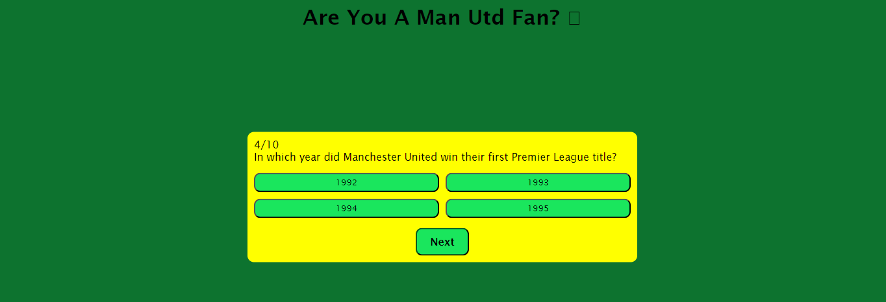

# Are You A Man Utd Fan?

Are You A Man Utd Fan? is a trivia quiz Manchester United football club. It is designed to test the knowledge of so called 'fans" and see whether they actually are fans or just claim to be!
The site can be accessed by this [link](https://khalidcodes1.github.io/Are-You-A-Man-Utd-Fan/)


## User stories
### First Time Visitor Goals:
* As a First Time Visitor, I want to easily understand the main purpose of the site.
* As a First Time Visitor, I want to be able to easily navigate through the website.
### Frequent Visitor Goals:
* As a Frequent User, I want to see whether the quiz has been updated with new questions.
## Features

+ ### Welcome Page

    - Represent: 

        * the main goal of the application.
        * Emphasize the the easiness of the using the application.

    

    - Menu page has 1 main button:

        1. That allows the user to begin the quiz;

        
+ ### Question and answer page
    - It has a button that allows the user to navigate to the next question in the quiz;

    - It has 4 buttons that hold the answer choices for the current question;
    

+ ### Results Page
    - It has a button that allows the user to restart the quiz and play again;

    - It displays the users score for the quiz as well;
     


## Flowchart

The flowchart represents the logic of the application:

  


## Technologies Used

- [HTML](https://developer.mozilla.org/en-US/docs/Web/HTML) was used as the foundation of the site.
- [CSS](https://developer.mozilla.org/en-US/docs/Web/css) - was used to add the styles and layout of the site.
- [CSS Flexbox](https://developer.mozilla.org/en-US/docs/Learn/CSS/CSS_layout/Flexbox) - was used to arrange items simmetrically on the pages.
- [CSS roots](https://developer.mozilla.org/en-US/docs/Web/CSS/:root) was used to declaring global CSS variables and apply them throughout the project. 
- [Git](https://git-scm.com/) was used for the version control of the website.
- [GitHub](https://github.com/) was used to host the code of the website.

+ ##### Solved bugs
    1. The next button to move on to the next question was not working
        *Solutions:* I added a function that handled the click event for the next button that would increment the current index by one and also call the show question as well.
        ```nextButton.addEventListener('click', () => {
    currentIndex++;
    nextQuestion();```
+ ##### Unsolved bugs
    - None.


## Testing

In order to confirm the correct functionality and responsiveness:

+ The website was tested on the following browsers:

    - Chrome

    - FireFox


+ The website was checked by devtools implemented in Firefox and Chrome browsers.

## Validator testing
+ ##### HTML
    - No errors or warnings were found when passing through the official [W3C](https://validator.w3.org/) validator.
    

+ ##### CSS
    - No errors or warnings were found when passing through the official [W3C (Jigsaw)](https://jigsaw.w3.org/css-validator/#validate_by_uri)    
    

+ ##### JS
    - No errors or warnings were found when passing through the official [JSHint](https://jshint.com/)  
      

+ ##### Accessibility and performance 
    - Using lighthouse in devtools I confirmed that the website is performing well, accessible and colors and fonts chosen are readable.
       

## Deployment

- The site was deployed to GitHub pages. The steps to deploy are as follows: 
  - In the [GitHub repository](https://github.com/iuliiakonovalova.github.io/flash_cards/), navigate to the Settings tab 
  - From the source section drop-down menu, select the **Main** Branch, then click "Save".
  - The page will be automatically refreshed with a detailed ribbon display to indicate the successful deployment.

  The live link can be found [here](https://khalidcodes1.github.io/Are-You-A-Man-Utd-Fan/)

    ## Local Deployment

In order to make a local copy of this project, you can clone it.
In your IDE Terminal, type the following command to clone my repository:

- `git clone https://github.com/khalidcodes1/Are-You-A-Man-Utd-Fan.git`     


## Credits

+ #### Content

  - My younger brother who is an even bigger Man Utd fan than myself for helping come up with the questions to the quiz.


## Acknowledgements

[Iuliia Konovalova](https://github.com/IuliiaKonovalova)

I am enormously thankful to my mentor Juliia for her guidance and valuable advice!  